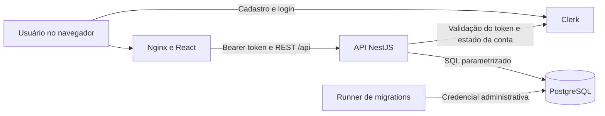

# Saldo: documentação técnica e funcional

Este documento descreve como o projeto Saldo funciona, onde cada responsabilidade está implementada e como executar, testar e evoluir o sistema.

## 1. Visão geral

Saldo é uma aplicação web de finanças pessoais em EUR. Cada pessoa possui um ambiente financeiro privado com contas, receitas, despesas, transferências, cartões, recorrências, orçamentos e metas.

O sistema separa dois conceitos:

- Real: fatos financeiros confirmados que alteram saldos.
- Planejado: previsões e compromissos que ajudam no planejamento, mas não alteram saldos antes da confirmação.

O saldo de uma conta não é armazenado como um número mutável. Ele é calculado usando o saldo de abertura e os efeitos das movimentações reais. Essa decisão evita divergências entre um saldo salvo e o histórico financeiro.

## 2. Stack

| Camada            | Tecnologia                            | Responsabilidade                                                |
| ----------------- | ------------------------------------- | --------------------------------------------------------------- |
| Frontend          | React, TypeScript e Vite              | Interface, navegação, formulários, gráficos e comunicação REST  |
| Dados no frontend | TanStack Query                        | Cache, carregamento e atualização de dados vindos da API        |
| Formulários       | React Hook Form e Zod                 | Estado dos formulários e validação no navegador                 |
| Backend           | NestJS e TypeScript                   | API REST, autenticação, regras financeiras e orquestração       |
| Consultas         | Drizzle ORM com SQL parametrizado     | Comunicação tipada e segura com PostgreSQL                      |
| Banco             | PostgreSQL                            | Persistência, constraints, transações, índices e isolamento RLS |
| Autenticação      | Clerk                                 | Cadastro, login, sessão, recuperação e verificação de e-mail    |
| Proxy web         | Nginx                                 | Serve o frontend compilado e encaminha `/api` para o NestJS     |
| Containers        | Docker Compose                        | Banco, migrations, API e frontend para teste local              |
| Testes            | Vitest, PGlite e PostgreSQL embarcado | Testes de domínio, integração, HTTP e concorrência              |

## 3. Arquitetura geral



O frontend e a API são servidos pela mesma origem no Docker. O navegador acessa `http://localhost:8080`; o Nginx entrega os arquivos React e encaminha requisições `/api` para o container da API.

O serviço de migrations usa uma credencial administrativa apenas durante a preparação do banco. A API utiliza o papel restrito `finance_app` e não recebe a senha administrativa.

## 4. Fluxo de uma requisição autenticada

1. O frontend obtém o token da sessão Clerk.
2. O frontend envia `Authorization: Bearer <token>`.
3. O limitador por IP protege a API antes da autenticação.
4. O adaptador Clerk valida assinatura, expiração, origem autorizada e audiência opcional.
5. O backend consulta, com cache curto, se o usuário está banido e se o e-mail principal está verificado.
6. `resolve_identity` converte a identidade Clerk em um UUID interno.
7. O guard grava esse UUID em `request.userId`.
8. O limitador por usuário controla a sessão autenticada.
9. O controller valida parâmetros e corpo com Zod.
10. A operação abre uma transação PostgreSQL e define `app.user_id` localmente.
11. O RLS permite acesso somente às linhas daquele usuário.
12. A resposta não é armazenada em cache e recebe um `X-Request-Id`.

## 5. Estrutura do repositório

```text
saldo/
  apps/
    api/
      migrations/             Histórico incremental do banco
      src/
        auth/                  Clerk, identidade interna e AuthGuard
        common/                Configuração, erros, throttle e validação
        database/              Pool, Drizzle, migrations e provisionamento
        domain/                Dinheiro, datas e regras puras
        health/                Liveness e readiness
        modules/               Controllers e serviços financeiros
    web/
      public/                  Arquivos públicos e headers de hospedagem
      src/
        components/            Componentes compartilhados da interface
        features/              Telas e fluxos de produto
        lib/                   Cliente REST, hooks e utilitários
        app.tsx                Layout, navegação e rotas
        main.tsx               Clerk, React Query e inicialização React
        styles.css             Tokens e estilos globais
  docker/
    nginx.conf                 Nginx, SPA, proxy e headers
  docs/                        Documentação do projeto
  scripts/                     Banco local, backup e testes PostgreSQL
  compose.yaml                 Serviços Docker
  Dockerfile                  Imagens da API e do frontend
  package.json                Scripts e workspaces
  .env                        Segredos locais, nunca versionado
  .env.example                Catálogo das variáveis disponíveis
```

## 6. Backend

### 6.1 Inicialização

`apps/api/src/main.ts`:

- valida configuração obrigatória;
- cria a aplicação NestJS;
- configura proxy confiável;
- aplica Helmet;
- configura CORS;
- cria IDs de requisição;
- desabilita cache nas respostas;
- registra o filtro global de erros;
- ativa encerramento controlado;
- inicia na porta e host configurados.

`apps/api/src/app.module.ts` registra os módulos, o banco, Clerk e os guards globais.

### 6.2 Autenticação

`apps/api/src/auth/auth.ts` contém:

- `ClerkIdentityProvider`: implementação atual de autenticação;
- `IdentityProvider`: contrato que permite substituir Clerk no futuro;
- `AuthGuard`: exige Bearer token e resolve o UUID interno;
- `Public`: decorator das rotas de health que não exigem login;
- `UserId`: decorator usado pelos controllers.

As tabelas financeiras não armazenam IDs Clerk. Elas apontam para `users.id`, um UUID interno. Isso reduz o acoplamento com o provedor de autenticação.

### 6.3 Configuração

`apps/api/src/common/config.ts` valida:

- URL do PostgreSQL;
- TLS obrigatório no banco em produção;
- chaves Clerk;
- origens CORS e Clerk;
- porta e host;
- proxy confiável;
- tamanho do pool;
- timeouts de conexão, consulta e transação;
- retenção de idempotência;
- limite de requisições.

A API deve falhar na inicialização quando uma configuração crítica estiver ausente ou inválida.

### 6.4 Banco e transações

`apps/api/src/database/database.service.ts` controla o pool PostgreSQL.

Existem dois caminhos principais:

- `tenantRead`: transação de leitura com contexto RLS, sem lock por usuário.
- `tenant`: transação de escrita com contexto RLS e lock consultivo por usuário.

O lock serializa escritas concorrentes da mesma pessoa. Usuários diferentes continuam independentes.

### 6.5 Regras financeiras

`apps/api/src/modules/finance.store.ts` centraliza operações compartilhadas:

- execução por usuário;
- idempotência;
- auditoria;
- validação de conta e categoria;
- criação de movimentação;
- cálculo de saldos.

`apps/api/src/domain/money.ts` contém regras de dinheiro e calendário:

- normalização monetária;
- soma decimal;
- mudança de mês;
- cálculo de vencimentos;
- distribuição de parcelas preservando centavos.

Valores monetários usam `NUMERIC(19,2)` no banco, strings na API e `decimal.js` nas regras. Float não é fonte de verdade financeira.

## 7. Frontend

### 7.1 Inicialização

`apps/web/src/main.tsx` configura:

- ClerkProvider;
- telas de login e cadastro;
- isolamento do cache ao trocar de usuário;
- QueryClient;
- BrowserRouter;
- montagem da aplicação React.

### 7.2 Layout e rotas

`apps/web/src/app.tsx` contém a navegação principal:

- Visão geral;
- Movimentações;
- Contas;
- Cartões;
- Orçamento;
- Metas;
- Recorrentes;
- Categorias.

Também controla os diálogos compartilhados de formulários e compras.

### 7.3 Cliente da API

`apps/web/src/lib/api.tsx`:

- obtém o token Clerk;
- chama a API configurada por `VITE_API_URL`;
- interpreta erros;
- fornece `useData` para consultas;
- fornece `useSave` para mutações;
- invalida os dados afetados depois de uma alteração;
- possui utilitários de data e formatação EUR.

### 7.4 Telas

| Arquivo                        | Responsabilidade                                                             |
| ------------------------------ | ---------------------------------------------------------------------------- |
| `features/dashboard.tsx`       | Dashboard, totais, gráficos, orçamento e metas                               |
| `features/pages.tsx`           | Contas, movimentações, cartões, orçamento, metas, recorrências e categorias  |
| `features/forms.ts`            | Especificações e validações dos formulários                                  |
| `features/purchase-dialog.tsx` | Criação e edição em etapas de compras parceladas                             |
| `components/ui.tsx`            | Modal, campos, dropdowns pesquisáveis, estados vazios e navegação de período |
| `styles.css`                   | Layout responsivo, tokens, tipografia e componentes visuais                  |

## 8. Modelo de dados

### 8.1 Identidade e infraestrutura

| Tabela              | Função                                                   |
| ------------------- | -------------------------------------------------------- |
| `users`             | Usuário interno e estado de inicialização das categorias |
| `identities`        | Liga provedor e subject externo ao UUID interno          |
| `audit_events`      | Antes e depois de alterações relevantes                  |
| `idempotency_keys`  | Resultado de operações repetíveis com segurança          |
| `schema_migrations` | Nome, hash e data das migrations aplicadas               |

### 8.2 Controle financeiro

| Tabela            | Função                                               |
| ----------------- | ---------------------------------------------------- |
| `accounts`        | Contas, dinheiro, benefícios e cofrinhos             |
| `categories`      | Categorias individuais de receita ou despesa         |
| `transactions`    | Receita, despesa e transferência realizadas          |
| `account_effects` | View que converte movimentações em efeitos por conta |
| `cash_effects`    | View que produz receitas e despesas para relatórios  |

### 8.3 Planejamento

| Tabela                | Função                                                                |
| --------------------- | --------------------------------------------------------------------- |
| `recurrences`         | Regras esperadas com intervalo configurável                           |
| `occurrences`         | Ocorrências mensais pendentes, ignoradas ou confirmadas               |
| `budget_rules`        | Versões do orçamento padrão a partir de determinado mês               |
| `budgets`             | Exceções de orçamento para um único mês                               |
| `goals`               | Objetivos associados a contas reservadas                              |
| `future_plans`        | Cenários futuros isolados do fluxo financeiro real                    |
| `future_plan_items`   | Receitas e gastos hipotéticos, pontuais ou mensais, de cada cenário   |
| `future_plan_pockets` | Caixas Principal, benefício e reserva isoladas dentro de cada cenário |

### 8.4 Cartões

| Tabela         | Função                                         |
| -------------- | ---------------------------------------------- |
| `cards`        | Nome, dia de fechamento e vencimento           |
| `purchases`    | Compra e categoria da despesa                  |
| `installments` | Parcelas e valores individuais                 |
| `invoices`     | Agrupamento mensal e movimentação de pagamento |

Todas as relações financeiras importantes incluem `user_id`. Chaves estrangeiras compostas impedem relacionamentos entre registros de usuários diferentes.

## 9. Contas e saldo

Uma conta possui duas classificações independentes.

Natureza:

- `bank`: conta bancária;
- `cash`: dinheiro físico;
- `benefit`: vale ou benefício;
- `pot`: cofrinho ou caixinha;
- `other`: outro tipo.

Finalidade:

- `available`: dinheiro disponível;
- `restricted`: saldo com uso restrito;
- `reserved`: reserva ou objetivo.

O saldo em uma data é:

```text
saldo de abertura
+ receitas recebidas
- despesas pagas
+ transferências recebidas
- transferências enviadas
```

Transferências não aumentam receita nem despesa. Somente a diferença entre enviado e recebido pode produzir uma despesa.

Exemplo de transferência com perda:

```text
Vale alimentação: -100 EUR
Conta bancária: +90 EUR
Perda em taxas: 10 EUR
Variação patrimonial: -10 EUR
```

## 10. Movimentações reais

### Receita

Exige conta de destino, categoria de receita, valor, descrição e data. Aumenta o saldo da conta.

### Despesa

Exige conta de origem, categoria de despesa, valor, descrição e data. Reduz o saldo da conta.

### Transferência

Exige origem, destino, valor enviado e valor recebido. Origem e destino devem ser diferentes.

Se enviado e recebido forem iguais, a transferência não possui categoria. Se o valor recebido for menor, a diferença exige uma categoria de despesa.

Movimentações usam `version` para controle de concorrência. Uma edição feita sobre versão antiga recebe HTTP 409 em vez de sobrescrever uma alteração mais recente.

Exclusão é lógica. O registro permanece para auditoria, mas deixa de participar dos saldos e relatórios.

## 11. Recorrências

Uma recorrência representa uma expectativa com intervalo de 1 a 24 meses. Ela nunca altera saldo diretamente.

Ao consultar um mês, o sistema materializa uma ocorrência de forma idempotente. A ocorrência pode ser:

- `pending`: prevista e aguardando ação;
- `skipped`: ignorada;
- `confirmed`: associada a uma movimentação real.

Confirmar cria uma movimentação real. Vincular associa uma movimentação já existente, evitando duplicação.

Editar uma ocorrência muda somente aquele mês. Editar a regra pode atualizar ocorrências pendentes futuras.

## 12. Orçamento

O orçamento possui duas camadas:

- regra padrão contínua em `budget_rules`;
- exceção mensal em `budgets`.

Uma mudança com escopo `future` vale a partir do mês escolhido. Uma mudança com escopo `month` afeta somente aquele mês.

Para cada categoria, a API retorna:

- orçamento efetivo;
- origem do limite;
- gasto realizado;
- recorrências pendentes;
- parcelas comprometidas;
- restante real;
- margem depois dos compromissos;
- percentual utilizado.

Somente gastos reais entram em realizado. Previsões e parcelas aparecem separadamente.

## 13. Metas

Uma meta aponta para uma conta reservada. O valor atual não é duplicado na meta; ele deriva do saldo da conta.

A API calcula:

- saldo atual;
- valor restante;
- progresso percentual;
- meses estimados usando o aporte mensal planejado.

## 14. Cartões, compras e faturas

Uma compra de cartão cria dívida, parcelas e faturas. Ela não reduz uma conta bancária naquele momento.

O fluxo de compra possui revisão antes de salvar:

1. usuário informa cartão, categoria, descrição, data, valor e quantidade de parcelas;
2. sistema calcula as faturas e parcelas;
3. usuário pode ajustar cada parcela;
4. usuário pode marcar parcelas históricas como já pagas antes do acompanhamento;
5. somente a confirmação final cria a compra.

A compra pode ser editada enquanto nenhuma parcela relacionada estiver paga no sistema. A edição substitui atomicamente a programação ainda não paga.

Pagar uma fatura cria uma despesa real única na conta escolhida. A view `cash_effects` distribui esse pagamento entre as categorias das compras. O pagamento é integral; pagamento parcial e rotativo não fazem parte do modelo atual.

## 15. Contrato REST

Prefixo: `/api`.

Todas as rotas, exceto health, exigem:

```http
Authorization: Bearer <token Clerk>
```

Operações críticas de criação ou confirmação exigem:

```http
Idempotency-Key: <UUID>
```

Convenções:

- dinheiro: string decimal, como `"125.50"`;
- data: `YYYY-MM-DD`;
- mês: `YYYY-MM`;
- IDs: UUID;
- erros: objeto com `message` e `request_id`;
- `user_id`: nunca é aceito como autoridade no corpo.

### 15.1 Health

| Método | Rota            | Função                                        |
| ------ | --------------- | --------------------------------------------- |
| GET    | `/health/live`  | Confirma que o processo está executando       |
| GET    | `/health/ready` | Confirma que a API consegue consultar o banco |

### 15.2 Identidade, contas e categorias

| Método | Rota              | Função                                   |
| ------ | ----------------- | ---------------------------------------- |
| GET    | `/me`             | Retorna identidade interna, moeda e fuso |
| GET    | `/accounts`       | Lista contas com saldo derivado          |
| POST   | `/accounts`       | Cria uma conta                           |
| PATCH  | `/accounts/:id`   | Corrige ou arquiva uma conta             |
| GET    | `/categories`     | Lista e inicializa categorias padrão     |
| POST   | `/categories`     | Cria categoria personalizada             |
| PATCH  | `/categories/:id` | Renomeia ou arquiva categoria            |

### 15.3 Movimentações

| Método | Rota                                 | Função                                 |
| ------ | ------------------------------------ | -------------------------------------- |
| GET    | `/transactions?month=YYYY-MM&page=1` | Lista 50 movimentações por página      |
| POST   | `/transactions`                      | Cria receita, despesa ou transferência |
| PATCH  | `/transactions/:id`                  | Edita usando controle de versão        |
| DELETE | `/transactions/:id?version=N`        | Faz exclusão lógica                    |

Filtros opcionais da listagem: `account_id` e `category_id`.

### 15.4 Recorrências e ocorrências

| Método | Rota                                | Função                                |
| ------ | ----------------------------------- | ------------------------------------- |
| GET    | `/recurrences`                      | Lista regras recorrentes              |
| POST   | `/recurrences`                      | Cria regra com intervalo configurável |
| PATCH  | `/recurrences/:id`                  | Edita ou ativa/desativa regra         |
| GET    | `/occurrences?month=YYYY-MM`        | Materializa e lista previsões do mês  |
| PATCH  | `/occurrences/:id`                  | Edita ou ignora uma ocorrência        |
| POST   | `/occurrences/:id/confirm`          | Cria a movimentação real              |
| POST   | `/occurrences/:id/link-transaction` | Vincula movimentação existente        |

### 15.5 Orçamentos e metas

| Método | Rota                                      | Função                                |
| ------ | ----------------------------------------- | ------------------------------------- |
| GET    | `/budgets/:month`                         | Retorna orçamento e utilização do mês |
| PUT    | `/budgets/:month`                         | Salva regra futura ou exceção mensal  |
| DELETE | `/budgets/:month/:categoryId/override`    | Remove exceção mensal                 |
| GET    | `/goals`                                  | Lista metas e progresso calculado     |
| POST   | `/goals`                                  | Cria meta associada a uma conta       |
| PATCH  | `/goals/:id`                              | Edita ou arquiva meta                 |
| GET    | `/future-plans`                           | Lista cenários futuros                |
| POST   | `/future-plans`                           | Cria cenário isolado                  |
| PATCH  | `/future-plans/:id`                       | Edita, conclui ou arquiva cenário     |
| DELETE | `/future-plans/:id`                       | Exclui o cenário e seus itens         |
| POST   | `/future-plans/:id/items`                 | Adiciona receita ou gasto ao cenário  |
| PATCH  | `/future-plans/:planId/items/:itemId`     | Edita uma hipótese do cenário         |
| DELETE | `/future-plans/:planId/items/:itemId`     | Remove uma hipótese do cenário        |
| POST   | `/future-plans/:id/pockets`               | Cria uma caixa separada no cenário    |
| PATCH  | `/future-plans/:planId/pockets/:pocketId` | Edita uma caixa do cenário            |
| DELETE | `/future-plans/:planId/pockets/:pocketId` | Exclui uma caixa vazia                |

### 15.6 Cartões

| Método | Rota                | Função                                     |
| ------ | ------------------- | ------------------------------------------ |
| GET    | `/cards`            | Lista cartões                              |
| POST   | `/cards`            | Cria cartão sem armazenar número sensível  |
| GET    | `/purchases`        | Lista compras e dívida restante            |
| GET    | `/purchases/:id`    | Retorna compra e programação de parcelas   |
| POST   | `/purchases`        | Cria compra após revisão                   |
| PATCH  | `/purchases/:id`    | Edita compra e recria programação não paga |
| DELETE | `/purchases/:id`    | Exclui compra sem parcelas pagas           |
| GET    | `/invoices`         | Lista faturas e totais                     |
| GET    | `/invoices/:id`     | Mostra parcelas da fatura                  |
| POST   | `/invoices/:id/pay` | Confirma pagamento integral                |

### 15.7 Relatórios

| Método | Rota                              | Função                                  |
| ------ | --------------------------------- | --------------------------------------- |
| GET    | `/reports/overview?month=YYYY-MM` | Dashboard mensal e evolução de 12 meses |
| GET    | `/reports/annual?year=YYYY`       | Fluxos e posição anual                  |

## 16. Segurança e isolamento

O isolamento usa várias barreiras:

1. Token Clerk validado no backend.
2. UUID interno derivado da sessão, nunca do corpo.
3. Filtros explícitos por `user_id` nas consultas.
4. RLS forçada nas tabelas financeiras.
5. `app.user_id` definido somente na transação.
6. Papel `finance_app` sem superusuário e sem `BYPASSRLS`.
7. Chaves estrangeiras compostas com `user_id`.
8. Tabela de identidades inacessível diretamente pela API.
9. Função `resolve_identity` com `SECURITY DEFINER` e `search_path` restrito.
10. SQL parametrizado.
11. Validação Zod no backend.
12. Rate limit por IP e por usuário.
13. CORS com origens explícitas.
14. Respostas financeiras com `Cache-Control: no-store`.
15. Logs sem parâmetros SQL, tokens ou valores financeiros.

## 17. Idempotência e auditoria

Uma chave de idempotência é vinculada a:

- usuário;
- UUID da operação;
- hash do conteúdo recebido;
- resposta produzida.

Repetir a mesma chave e o mesmo conteúdo devolve a resposta anterior. Repetir a chave com outro conteúdo retorna conflito.

Eventos de auditoria registram entidade, ação, estado anterior, estado posterior e horário. Auditoria ajuda a investigar alterações, mas não é um event sourcing completo.

## 18. Docker

`compose.yaml` define quatro serviços:

| Serviço   | Função                                       | Exposição                    |
| --------- | -------------------------------------------- | ---------------------------- |
| `db`      | PostgreSQL 17                                | `127.0.0.1:55433` por padrão |
| `migrate` | Aplica migrations e provisiona `finance_app` | Nenhuma porta                |
| `api`     | NestJS compilado                             | Somente rede interna Docker  |
| `web`     | Nginx e frontend React                       | `127.0.0.1:8080` por padrão  |

Ordem de inicialização:

```text
db saudável -> migrate concluído -> api saudável -> web
```

Subir:

```sh
npm run docker:up
```

Abrir:

```text
http://localhost:8080
```

Logs:

```sh
npm run docker:logs
```

Parar preservando os dados:

```sh
npm run docker:down
```

Remover também o banco Docker:

```sh
docker compose down -v
```

O último comando é destrutivo somente para o volume Docker do projeto.

### Acesso público com Cloudflare Tunnel

O override `compose.cloudflare.yaml` adiciona um container `cloudflared` à mesma rede privada do Nginx. O túnel abre conexões de saída para a Cloudflare. Nenhuma porta do roteador precisa ser encaminhada.

Fluxo:

```text
navegador remoto
-> HTTPS Cloudflare
-> Cloudflare Tunnel
-> container web:8080
-> arquivos React ou proxy /api
-> container api:3000
-> container db:5432
```

A rota publicada no painel Cloudflare deve usar `http://web:8080` como Service URL. O ambiente público é iniciado com:

```sh
npm run docker:public:up
```

As variáveis obrigatórias adicionais são `PUBLIC_APP_URL`, `CLOUDFLARE_TUNNEL_TOKEN` e `CLERK_JWT_KEY`. A origem pública deve usar HTTPS e não deve terminar com barra.

O túnel não transforma um computador pessoal em hospedagem de alta disponibilidade. Se o computador desligar, o Docker parar ou a Internet cair, a aplicação fica indisponível.

## 19. Execução sem Docker

Preparar o PostgreSQL portátil e `.env`:

```sh
npm ci
npm run setup:local
```

Depois de configurar Clerk:

```sh
npm run dev:local
```

Endereços:

- frontend Vite: `http://localhost:5173`;
- API: `http://localhost:3000/api`;
- PostgreSQL portátil: `localhost:55432`.

## 20. Variáveis de ambiente

| Variável                             | Uso                                            |
| ------------------------------------ | ---------------------------------------------- |
| `DATABASE_ADMIN_URL`                 | Migrations e operações administrativas locais  |
| `DATABASE_URL`                       | Conexão restrita da API                        |
| `APP_DB_PASSWORD`                    | Provisionamento de `finance_app`               |
| `CLERK_SECRET_KEY`                   | Backend Clerk, nunca vai para o frontend       |
| `CLERK_JWT_KEY`                      | Chave pública para validação local em produção |
| `CLERK_AUDIENCE`                     | Audiência esperada opcional                    |
| `CLERK_AUTHORIZED_PARTIES`           | Origens autorizadas no token                   |
| `CLERK_STATUS_CACHE_SECONDS`         | Cache de estado do usuário Clerk               |
| `WEB_ORIGIN`                         | Origens CORS permitidas                        |
| `HOST` e `PORT`                      | Endereço da API                                |
| `TRUST_PROXY`                        | Quantidade ou faixa de proxies confiáveis      |
| `RATE_LIMIT_PER_MINUTE`              | Limite por IP e usuário                        |
| `DB_POOL_MAX`                        | Máximo de conexões por réplica                 |
| `DB_CONNECTION_TIMEOUT_MS`           | Tempo máximo para conectar                     |
| `DB_IDLE_TIMEOUT_MS`                 | Expiração de conexão ociosa                    |
| `DB_STATEMENT_TIMEOUT_MS`            | Tempo máximo de consulta                       |
| `DB_TRANSACTION_TIMEOUT_MS`          | Limite de transação ociosa                     |
| `DB_MAX_CONNECTION_LIFETIME_SECONDS` | Renovação preventiva de conexões               |
| `IDEMPOTENCY_RETENTION_DAYS`         | Retenção das chaves de idempotência            |
| `VITE_CLERK_PUBLISHABLE_KEY`         | Chave pública compilada no frontend            |
| `VITE_API_URL`                       | Prefixo da API usado pelo navegador            |
| `DOCKER_DB_PORT`                     | Porta local do PostgreSQL Docker               |
| `DOCKER_WEB_PORT`                    | Porta local do Nginx Docker                    |

Consulte `.env.example` para valores e nomes atualizados. Nunca versione `.env`.

## 21. Migrations

Os arquivos estão em `apps/api/migrations` e são executados em ordem alfabética.

O runner:

- obtém lock consultivo global;
- cria `schema_migrations` se necessário;
- calcula SHA-256 de cada arquivo;
- rejeita alterações em migration já aplicada;
- aplica cada migration em transação própria;
- registra nome, hash e data.

Para evoluir o banco:

1. nunca altere uma migration já aplicada;
2. crie o próximo arquivo numerado;
3. faça backup;
4. teste num banco isolado;
5. execute `npm run db:migrate`;
6. compare dados e rode os testes.

## 22. Backup

`npm run db:backup` cria em `.local/backups`:

- JSON consistente obtido em transação `REPEATABLE READ`;
- checksum SHA-256;
- permissões locais restritas quando suportadas.

Esse backup ajuda antes de migrations locais, mas não substitui `pg_dump`, backup gerenciado e restauração testada em produção.

## 23. Testes e qualidade

Comandos principais:

```sh
npm run typecheck
npm test
npm run test:postgres
npm run build
npm audit --omit=dev
```

Cobertura funcional importante:

- receita aumenta saldo;
- despesa reduz saldo;
- transferência comum preserva patrimônio;
- transferência com perda reduz patrimônio corretamente;
- usuários não acessam dados alheios;
- recorrência não altera saldo antes da confirmação;
- confirmação cria movimentação uma única vez;
- orçamento usa gastos reais;
- meta deriva do saldo da conta;
- edições concorrentes não sobrescrevem silenciosamente;
- pagamentos e confirmações repetidos são idempotentes;
- falhas no meio de uma transação causam rollback.

O CI em `.github/workflows/ci.yml` executa typecheck, testes, PostgreSQL real, build e auditoria npm. `codeql.yml` executa análise estática. `dependabot.yml` acompanha dependências npm e GitHub Actions.

## 24. Health e operação

Health checks:

- `/api/health/live`: processo ativo;
- `/api/health/ready`: banco acessível;
- `/healthz`: Nginx ativo no Docker.

Em produção, monitore:

- respostas 5xx;
- falhas de readiness;
- saturação do pool;
- latência de relatórios;
- conexões PostgreSQL;
- espaço em disco;
- falhas de login e rate limit;
- sucesso de backups e restaurações.

Use `request_id` para correlacionar o erro recebido pelo usuário com o log da API.

## 25. Onde alterar cada funcionalidade

| Necessidade                 | Arquivos principais                                                         |
| --------------------------- | --------------------------------------------------------------------------- |
| Nova regra de movimentação  | `finance.store.ts`, `validation.ts`, migrations e testes                    |
| Nova rota                   | Controller do módulo, validação e testes HTTP                               |
| Nova tabela ou índice       | Nova migration numerada                                                     |
| Novo indicador do dashboard | `reporting.controller.ts` e `dashboard.tsx`                                 |
| Mudança em recorrência      | `planning.controller.ts` e `planning.service.ts`                            |
| Mudança em orçamento        | `planning.controller.ts`, `planning.service.ts` e `pages.tsx`               |
| Mudança em compra parcelada | `cards.controller.ts` e `purchase-dialog.tsx`                               |
| Novo campo de formulário    | `forms.ts`, componente da tela, validação backend e migration se persistido |
| Mudança visual global       | `styles.css` e `components/ui.tsx`                                          |
| Autenticação                | `auth/auth.ts` e `main.tsx`                                                 |
| Configuração de produção    | `common/config.ts`, `.env.example` e `operations.md`                        |
| Docker ou proxy             | `compose.yaml`, `Dockerfile` e `docker/nginx.conf`                          |

## 26. Limites atuais

- moeda única EUR;
- regime de caixa;
- recorrências entre 1 e 24 meses;
- cartão com pagamento integral;
- sem rotativo, pagamento parcial ou juros automáticos;
- sem integração bancária;
- sem organizações ou compartilhamento;
- sem investimentos com cotação;
- cenários futuros sem ligação automática com contas ou transações;
- compras, faturas, cartões, recorrências e metas ainda precisam de paginação para históricos muito grandes;
- rate limit em memória atende uma réplica, mas múltiplas réplicas exigem Redis ou gateway compartilhado;
- relatórios históricos podem exigir snapshots reconstruíveis quando o volume justificar;
- exportação e exclusão completa da conta ainda precisam de fluxo com reautenticação recente.

## 27. Regras de evolução

- Preserve a separação entre real e planejado.
- Não salve saldo atual como fonte de verdade.
- Não aceite `user_id` do cliente como autorização.
- Toda escrita financeira deve ocorrer numa transação.
- Toda entidade financeira deve manter isolamento por usuário.
- Valores monetários nunca devem usar float.
- Migrations aplicadas são imutáveis.
- Toda criação repetível deve considerar idempotência.
- Alterações relevantes devem ser auditadas.
- Regras complexas devem ficar no backend, com UX simples no frontend.
- Antes de alterar dados reais, faça backup e valide a migration num banco isolado.

## 28. Documentos complementares

- `docs/architecture.md`: decisões de domínio e fórmulas.
- `docs/api.md`: resumo dos contratos REST.
- `docs/operations.md`: segurança, produção, backup e crescimento.
- `README.md`: instalação e comandos do dia a dia.
- `.env.example`: configuração disponível.

Este documento deve ser atualizado quando uma rota, tabela, regra financeira, variável de ambiente ou procedimento operacional mudar.
